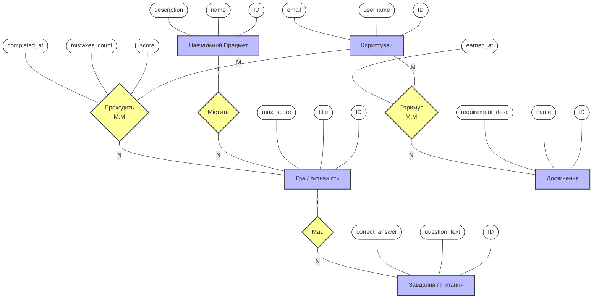

# Додаток 1. Концептуальна схема бази даних

```mermaid
flowchart TD
    %% Стилізація
    classDef entity fill:#bbf,stroke:#333,stroke-width:2px;
    classDef attribute fill:#fff,stroke:#333,stroke-width:1px,rx:20,ry:20;
    classDef relationship fill:#ff9,stroke:#333,stroke-width:2px,shape:diamond;

    %% Сутності
    U[Користувач]:::entity
    G[Гра / Активність]:::entity
    S[Навчальний Предмет]:::entity
    A[Досягнення]:::entity
    Q[Завдання / Питання]:::entity

    %% Атрибути Користувача
    U_id([ID]):::attribute --- U
    U_n([username]):::attribute --- U
    U_e([email]):::attribute --- U

    %% Атрибути Гри
    G_id([ID]):::attribute --- G
    G_t([title]):::attribute --- G
    G_m([max_score]):::attribute --- G

    %% Атрибути Завдання
    Q_id([ID]):::attribute --- Q
    Q_text([question_text]):::attribute --- Q
    Q_ans([correct_answer]):::attribute --- Q

    %% Атрибути Предмету
    S_id([ID]):::attribute --- S
    S_n([name]):::attribute --- S
    S_d([description]):::attribute --- S

    %% Атрибути Досягнення
    A_id([ID]):::attribute --- A
    A_n([name]):::attribute --- A
    A_req([requirement_desc]):::attribute --- A

    %% Зв'язки
    S_G{Містить}:::relationship
    S ---|1| S_G
    S_G ---|N| G

    G_Q{Має}:::relationship
    G ---|1| G_Q
    G_Q ---|N| Q

    U_G{Проходить <br> M:M}:::relationship
    U ---|M| U_G
    U_G ---|N| G
    
    %% Атрибути зв'язку "Проходить" (Сесія)
    Attr1([score]):::attribute --- U_G
    Attr2([mistakes_count]):::attribute --- U_G
    Attr3([completed_at]):::attribute --- U_G

    U_A{Отримує <br> M:M}:::relationship
    U ---|M| U_A
    U_A ---|N| A
    
    %% Атрибут зв'язку "Отримує"
    Attr4([earned_at]):::attribute --- U_A
```
