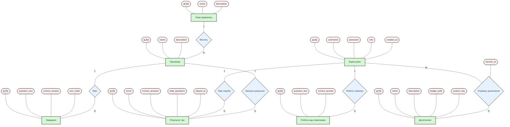

# Додаток 1. Концептуальна схема бази даних (Нотація Пітера Чена)

У цій концептуальній схемі (ER-діаграмі) у нотації Пітера Чена сутності зображені прямокутниками, їхні зв'язки — ромбами, а атрибути — овалами (з підкресленими первинними ключами `PK`). Зв'язок багато-до-багатьох (M:N) між Користувачем та Досягненням має власний атрибут зв'язку `earned_at`.

