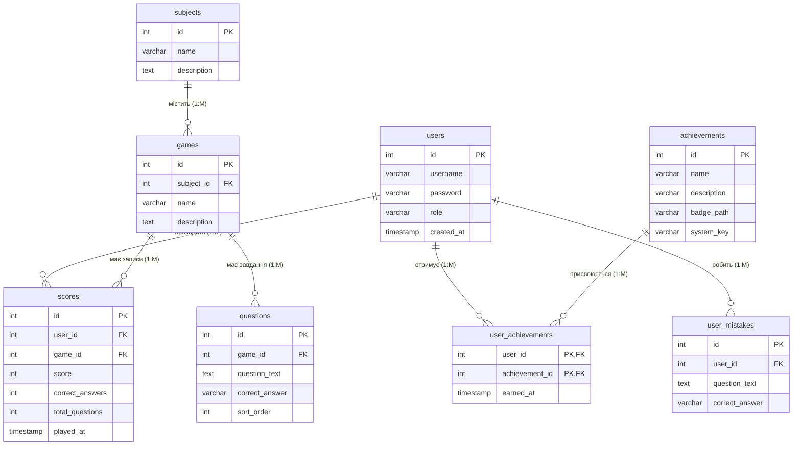

# Додаток 2. Структурна схема даних (Нотація Crow's Foot)

У цій структурі відображені реальні фізичні таблиці бази даних нашого розумного тренажера правопису, типи полів, первинні (`PK`) та зовнішні (`FK`) ключі, а також зв'язки «Один-до-Багатьох» (1:M) після нормалізації зв'язку багато-до-багатьох для досягнень.

