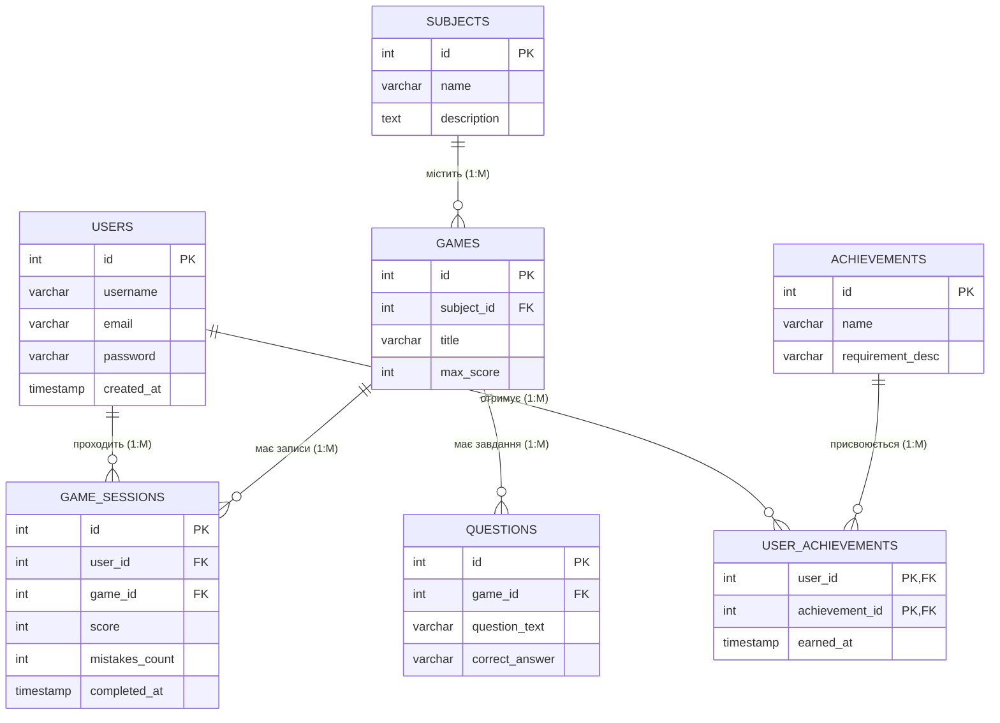

# Додаток 2. Структурна схема даних

```mermaid
erDiagram
    USERS ||--o{ GAME_SESSIONS : "проходить (1:M)"
    USERS ||--o{ USER_ACHIEVEMENTS : "отримує (1:M)"
    GAMES ||--o{ GAME_SESSIONS : "має записи (1:M)"
    GAMES ||--o{ QUESTIONS : "має завдання (1:M)"
    SUBJECTS ||--o{ GAMES : "містить (1:M)"
    ACHIEVEMENTS ||--o{ USER_ACHIEVEMENTS : "присвоюється (1:M)"

    USERS {
        int id PK
        varchar username
        varchar email
        varchar password
        timestamp created_at
    }
    SUBJECTS {
        int id PK
        varchar name
        text description
    }
    GAMES {
        int id PK
        int subject_id FK
        varchar title
        int max_score
    }
    QUESTIONS {
        int id PK
        int game_id FK
        varchar question_text
        varchar correct_answer
    }
    GAME_SESSIONS {
        int id PK
        int user_id FK
        int game_id FK
        int score
        int mistakes_count
        timestamp completed_at
    }
    ACHIEVEMENTS {
        int id PK
        varchar name
        varchar requirement_desc
    }
    USER_ACHIEVEMENTS {
        int user_id PK,FK
        int achievement_id PK,FK
        timestamp earned_at
    }
```
