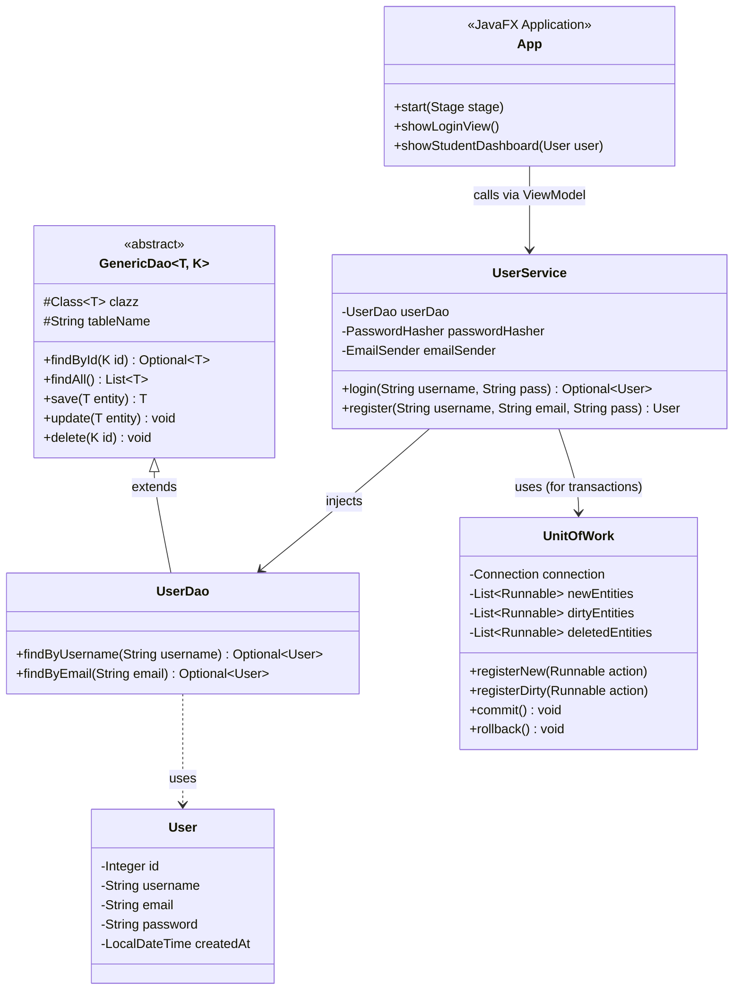

# Додаток 3. UML діаграма класів

```mermaid
classDiagram
    class User {
        -Integer id
        -String username
        -String email
        -String password
        -LocalDateTime createdAt
    }

    class GenericDao~T, K~ {
        <<abstract>>
        #Class~T~ clazz
        #String tableName
        +findById(K id) Optional~T~
        +findAll() List~T~
        +save(T entity) T
        +update(T entity) void
        +delete(K id) void
    }

    class UserDao {
        +findByUsername(String username) Optional~User~
        +findByEmail(String email) Optional~User~
    }

    class UnitOfWork {
        -Connection connection
        -List~Runnable~ newEntities
        -List~Runnable~ dirtyEntities
        -List~Runnable~ deletedEntities
        +registerNew(Runnable action)
        +registerDirty(Runnable action)
        +commit() void
        +rollback() void
    }

    class UserService {
        -UserDao userDao
        -PasswordHasher passwordHasher
        -EmailSender emailSender
        +login(String username, String pass) Optional~User~
        +register(String username, String email, String pass) User
    }

    class App {
        <<JavaFX Application>>
        +start(Stage stage)
        +showLoginView()
        +showStudentDashboard(User user)
    }

    GenericDao <|-- UserDao : extends
    UserDao ..> User : uses
    UserService --> UserDao : injects
    UserService --> UnitOfWork : uses (for transactions)
    App --> UserService : calls via ViewModel
```
