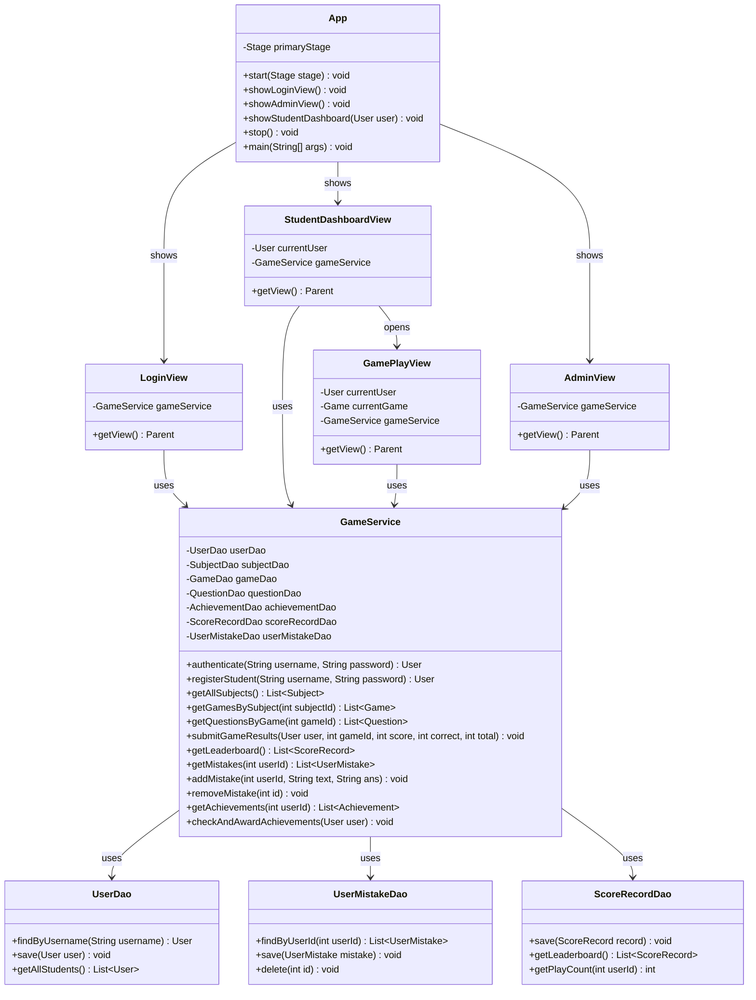

# Додаток 3. UML діаграма класів

У цій діаграмі відображена реальна об'єктно-орієнтована архітектура нашого програмного комплексу, що зв'язує графічні вікна JavaFX (Views), сервісний шар бізнес-логіки (`GameService`) та класи доступу до бази даних (DAOs).

