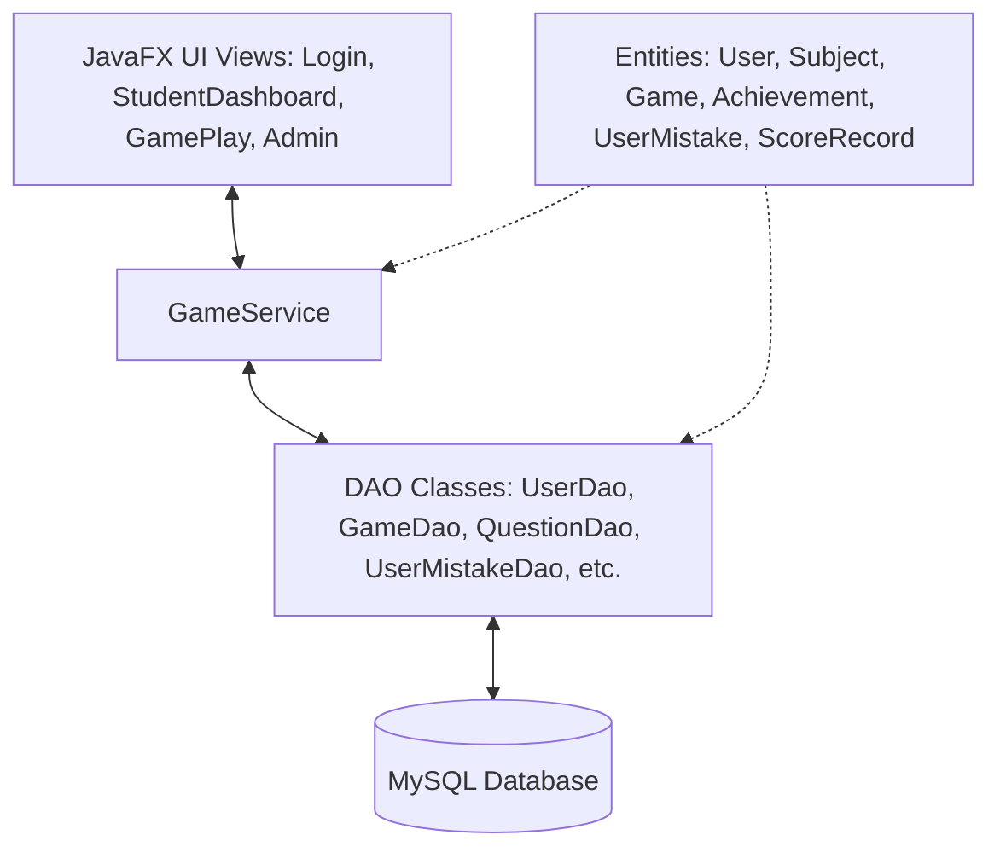
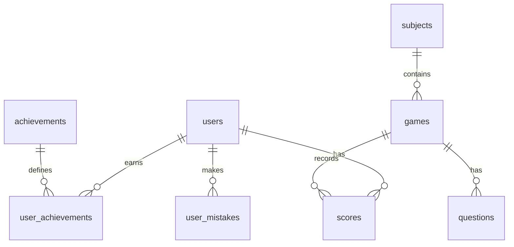

# Документація проекту: Розумний тренажер правопису з системою моніторингу прогресу
## (Smart Spelling Trainer with Progress Monitoring System)

---

## 1. Загальний опис та призначення проекту

**«Розумний тренажер правопису з системою моніторингу прогресу»** — це кросплатформний програмний комплекс на базі JavaFX з клієнт-серверною архітектурою (MySQL), розроблений для інтерактивного вивчення, тренування та контролю знань з української орфографії. 

Проект трансформовано з базового консольного додатку у високотехнологічну систему з преміальним графічним інтерфейсом, гейміфікованим процесом навчання, гнучкою системою аналізу помилок учня та інтелектуальною перевіркою відповідей.

### Ключові можливості системи:
* **Багаторівнева структура знань**: Предметна область розбита на теми (правила вживання апострофа, подвоєння літер, спрощення приголосних, м'який знак), кожна з яких містить окремі практичні вправи.
* **Інтерактивні інструменти відповіді**: Автоматичний парсинг підказок (наприклад, `(н чи нн)`) у тексті запитань для відображення стильних кнопок швидкого вибору (`ToggleButton`), що спрощує взаємодію на сенсорних чи мобільних екранах, зберігаючи текстове поле лише для диктантів.
* **Асинхронний 2-Факторний вхід для Адміністратора (2FA)**: Додатковий рівень безпеки для адмін-панелі. При спробі входу генерується унікальний 6-значний код, який асинхронно надсилається на пошту `c.povkhanych.nazarii@student.uzhnu.edu.ua` без блокування інтерфейсу JavaFX.
* **Робота над помилками (Mistakes Review)**: Усі слова, в яких учень припустився помилки, автоматично зберігаються в окрему таблицю БД. Учень може запустити індивідуальну сесію тренування суто за своїм пулом помилок. При правильній відповіді слово автоматично видаляється з пулу помилок.
* **Гейміфікація та Нагороди**: Автоматичне відстеження та нарахування 8 складних досягнень. Після збирання всіх 8 досягнень стає активною кнопка випуску **«Золотого Сертифіката Грамотності»** з іменем учня та підписом розробника (`Nazarii Povkhanych`).
* **Дві преміальні теми**: Швидке перемикання між неоновим темним оформленням (**Slate-Dark**) та лаконічним світлим оформленням (**Apple Light-Slate**) без перезапуску додатку.
* **Інтерактивна Книга Правил**: Вбудований посібник з орфографії для швидкого повторення теорії безпосередньо перед тестом.

---

## 2. Технологічний стек проекту

Система побудована на базі сучасних інструментів розробки корпоративного рівня:

* **Мова програмування**: Java 21 (LTS) — використовує переваги сучасного синтаксису (Pattern Matching, Switch Expressions, Records, покращені колекції).
* **Графічний інтерфейс**: JavaFX 21.0.2 — забезпечує апаратне прискорення рендерингу UI та гнучку стилізацію через CSS.
* **База даних**: MySQL — реляційне сховище для надійного збереження даних користувачів, статистики, запитань та прогресу.
* **Управління пулом з'єднань**: Власна високопродуктивна реалізація `ConnectionPool` з підтримкою багатопоточності.
* **Міграції бази даних**: Flyway — автоматичне версіонування та накатування схем бази даних при запуску програми.
* **Безпека**: BCrypt (вбудований у сервіси додатку) — криптографічне одностороннє хешування паролів користувачів.
* **Поштовий транспорт**: Jakarta Mail (раніше JavaMail) + SMTP-протокол — для реалізації асинхронної доставки кодів двофакторної автентифікації.
* **Збирання та менеджмент залежностей**: Apache Maven — автоматизоване керування залежностями та побудова Fat JAR.
* **Інструменти якості коду**: `spotless-maven-plugin` (стиль AOSP) — суворе автоматичне форматування коду Java.
* **Пакування додатку**: `jpackage` (JDK Tool) — створення нативних установочних дистрибутивів під кожну ОС (`.msi` на Windows, `.dmg` на macOS, `.deb` на Linux).

---

## 3. Детальна архітектура додатку

Проект побудований за трирівневою архітектурою з чітким розділенням обов'язків: **Рівень представлення (View) ↔ Сервісний рівень бізнес-логіки (Service) ↔ Рівень доступу до даних (DAO) ↔ Моделі даних (Entity)**.



### 3.1. Моделі даних (Entity Layer)
Класи-сутності представляють таблиці бази даних в об'єктно-орієнтованому вигляді:
1. `User.java` — Користувач системи (учень або адміністратор). Містить поля: ID, ім'я користувача, хеш пароля, роль (`ADMIN`, `STUDENT`), дата створення.
2. `Subject.java` — Тематичний предмет правопису (наприклад, "Орфографія").
3. `Game.java` — Конкретна вправа в межах предмету (наприклад, "Апостроф у питомих українських словах"). Містить посилання на `Subject` та опис вправи.
4. `Question.java` — Запитання (орфографічне завдання). Містить текст завдання, правильні відповіді (розділені символом `|` для підтримки альтернативних варіантів), посилання на `Game` та порядковий номер.
5. `Achievement.java` — Опис досягнення. Містить назву, опис, шлях до іконки та унікальний системний ключ.
6. `UserAchievement.java` — Факт отримання досягнення учнем (зв'язок багато-до-багатьох між `User` та `Achievement` із датою нагородження).
7. `UserMistake.java` — Запис про помилку учня. Містить посилання на користувача, оригінальний текст запитання та правильну відповідь для повторного опрацювання.
8. `ScoreRecord.java` — Запис про проходження гри користувачем (статистика сесії: кількість правильних відповідей, загальний бал, час проходження).

### 3.2. Рівень доступу до даних (DAO Layer)
DAO класи відповідають за виконання SQL-запитів до бази даних, використовуючи `ConnectionPool`. Вони ізолюють SQL-код від бізнес-логіки:
* `UserDao.java` — Створення користувачів, пошук за іменем, аутентифікація через BCrypt.
* `SubjectDao.java` / `GameDao.java` — Вибірка доступних предметів та активних вправ.
* `QuestionDao.java` — Отримання списку питань для обраної гри в правильному порядку.
* `AchievementDao.java` — Перевірка наявності досягнень, нагородження користувача новими значками.
* `UserMistakeDao.java` — Додавання помилки до пулу користувача, отримання повного списку помилок користувача, видалення помилки після успішного проходження роботи над помилками.
* `ScoreRecordDao.java` — Збереження результатів ігор, отримання історії оцінок учня.

### 3.3. Сервісний рівень бізнес-логіки (Service Layer)
Вся логіка взаємодії елементів зосереджена в сервісі:
* `GameService.java` — Центральний контролер бізнес-процесів:
  * Проводить оцінку відповідей учнів згідно з алгоритмом м'якої валідації.
  * Обчислює фінальний бал за гру.
  * Реєструє помилки в базі даних.
  * Викликає асинхронну перевірку досягнень користувача після кожної гри.
  * Будує зведений рейтинг класу (Leaderboard) за допомогою агрегуючих SQL запитів.

### 3.4. Рівень графічного інтерфейсу (View/GUI Layer)
Побудований за компонентно-модульним принципом JavaFX:
1. `LoginView.java` — Екран авторизації з вибором профілю, формою введення пароля та візуальним оверлеєм для введення та перевірки асинхронного 2FA-коду адміна.
2. `StudentDashboardView.java` — Головний робочий кабінет учня:
   * Зліва розташована панель профілю, статистика пройдених ігор, список зароблених медалей та велика золота кнопка **«Сертифікат Грамотності»** (яка активується лише при 8/8 досягнень).
   * По центру — інтерактивна таблиця лідерборду класу та вибір вправ.
   * Зверху — кнопка виклику книги правил та перемикач теми (Світла/Темна).
   * Інтегровано кнопку «Робота над помилками», яка запускає тренувальний режим із `gameId = -1` (пул помилок учня).
3. `GamePlayView.java` — Екран проходження тесту. Динамічно адаптується під тип запитання (візуальні кнопки-пігулки або поле вводу), показує прогрес-бар, рахунок та гарне модальне вікно результату після завершення.
4. `AdminView.java` — Інтерфейс адміністратора для перегляду та редагування вправ, додавання користувачів, налаштування запитань у вигляді зручних вкладок.

---

## 4. Проектування та структура Бази Даних

Схема бази даних розроблена з урахуванням нормалізації даних та оптимізації реляційних зв'язків.



### 4.1. Опис таблиць бази даних

#### 1. Таблиця `users` (Користувачі)
Зберігає облікові записи користувачів із безпечними хешами паролів.
* `id` (INT, Primary Key, Auto Increment) — Унікальний ідентифікатор.
* `username` (VARCHAR(50), Unique, Not Null) — Ім'я користувача (логін).
* `password` (VARCHAR(255), Not Null) — Захешований за допомогою **BCrypt** пароль.
* `role` (VARCHAR(20), Not Null) — Роль у системі (`ADMIN` або `STUDENT`).
* `created_at` (TIMESTAMP, Default Current_Timestamp) — Дата реєстрації.

#### 2. Таблиця `subjects` (Навчальні предмети)
* `id` (INT, Primary Key, Auto Increment) — Унікальний ідентифікатор предмету.
* `name` (VARCHAR(100), Not Null) — Назва (наприклад, "Українська мова").
* `description` (TEXT) — Опис.

#### 3. Таблиця `games` (Практичні вправи)
* `id` (INT, Primary Key, Auto Increment) — Унікальний ідентифікатор вправи.
* `subject_id` (INT, Foreign Key) — Зв'язок із таблицею `subjects`.
* `name` (VARCHAR(100), Not Null) — Назва вправи (наприклад, "Подвоєння літер у загальних назвах").
* `description` (TEXT) — Інструкція до виконання.

#### 4. Таблиця `questions` (Орфографічні завдання)
* `id` (INT, Primary Key, Auto Increment) — Ідентифікатор запитання.
* `game_id` (INT, Foreign Key) — Зв'язок із таблицею `games`.
* `question_text` (TEXT, Not Null) — Речення чи слово із пропущеним символом (наприклад, "комп_ютер" або "свяще_ник (н чи нн)").
* `correct_answer` (VARCHAR(100), Not Null) — Правильна відповідь. Може містити альтернативи через знак `|` (наприклад, `комп'ютер|'`).
* `sort_order` (INT) — Порядок показу запитання.

#### 5. Таблиця `achievements` (Системні досягнення)
* `id` (INT, Primary Key, Auto Increment) — Ідентифікатор досягнення.
* `name` (VARCHAR(100), Not Null) — Назва медалі (наприклад, "Марафонець").
* `description` (VARCHAR(255)) — Умова отримання.
* `badge_path` (VARCHAR(255)) — Шлях до зображення медалі.
* `system_key` (VARCHAR(50), Unique) — Системний ключ для коду перевірки бізнес-логіки.

#### 6. Таблиця `user_achievements` (Досягнення користувачів)
Зв'язок багато-до-багатьох для нагородження учнів.
* `user_id` (INT, Foreign Key) — Зв'язок із `users`.
* `achievement_id` (INT, Foreign Key) — Зв'язок із `achievements`.
* `earned_at` (TIMESTAMP) — Точний час отримання медалі.
* *Composite Primary Key*: `(user_id, achievement_id)`.

#### 7. Таблиця `user_mistakes` (Пул помилок користувачів)
Зберігає слова, в яких учень зробив помилку, для індивідуального опрацювання.
* `id` (INT, Primary Key, Auto Increment) — Ідентифікатор помилки.
* `user_id` (INT, Foreign Key) — Зв'язок із `users`.
* `question_text` (TEXT, Not Null) — Текст запитання, у якому була помилка.
* `correct_answer` (VARCHAR(100), Not Null) — Очікувана відповідь.

#### 8. Таблиця `scores` (Результати ігор)
* `id` (INT, Primary Key, Auto Increment) — Ідентифікатор спроби.
* `user_id` (INT, Foreign Key) — Зв'язок із `users`.
* `game_id` (INT, Foreign Key) — Зв'язок із `games`.
* `score` (INT) — Кількість набраних балів (у відсотках).
* `correct_answers` (INT) — Кількість правильних відповідей.
* `total_questions` (INT) — Загальна кількість запитань у сесії.
* `played_at` (TIMESTAMP) — Час проходження вправи.

### 4.2. База даних: Роль міграцій Flyway
Міграції Flyway знаходяться в каталозі `src/main/resources/db/migration/` та накочуються автоматично:
* `V1__Initial_schema.sql` — Створення базових таблиць користувачів, ігор та результатів.
* `V2__Add_achievements.sql` — Створення таблиць досягнень та первинне засівання досягнень.
* `V3__Insert_default_users.sql` — Створення користувачів за замовчуванням.
* `V4__Secure_passwords.sql` — Перехід на безпечні хеші BCrypt для паролів.
* `V5__Update_to_spelling_trainer.sql` — **Глобальна трансформація**: видалення математичних/історичних даних, внесення тем українського правопису, детальних запитань на правила апострофа та подвоєння. Хешування паролів для стандартних користувачів (`Олександр`, `Марія`, `Іван`) паролем `"12345"`.
* `V6__Add_extra_achievements.sql` — Додавання 4 додаткових складних медалей для розширення системи прогресу до 8 медалей.
* `V7__Create_user_mistakes_table.sql` — Створення таблиці `user_mistakes` для реалізації роботи над помилками.

---

## 5. Опис ключових алгоритмів бізнес-логіки

Проект містить декілька інноваційних алгоритмів, що забезпечують розумну перевірку знань та преміальну чуйність UI.

### 5.1. Алгоритм інтелектуальної («м'якої») валідації відповідей
Українська мова має специфічні символи орфографії, зокрема апостроф, який користувачі можуть вводити різними способами на різних розкладках клавіатури. Алгоритм валідації в `GamePlayView` працює за такою схемою:

1. **Нормалізація апострофа**: Усі вхідні та правильні відповіді проходять через уніфікацію апострофів. Символи `'` (одинарна лапка), `` ` `` (зворотний апостроф) та `’` (типографічний апостроф) замінюються на один єдиний стандартний символ `'`.
2. **Аналіз альтернативних відповідей**: Поле `correct_answer` розділяється символом `|`. Наприклад, якщо правильна відповідь `"комп'ютер|'"`, учень отримає зарахований бал як за введення всього правильно написаного слова (`комп'ютер`), так і за введення лише пропущеного символу (`'`).
3. **Очищення пробілів та регістру**: Перед порівнянням відповідь очищається від зайвих пробілів на початку/в кінці та переводиться в нижній регістр (`.trim().toLowerCase()`).

### 5.2. Алгоритм динамічного парсингу варіантів відповідей (Toggle Pill Generator)
Для зручності користувачів у системі реалізовано автоматичний парсинг опцій вибору в тексті запитання:

1. **Пошук патерну**: Код аналізує рядок `question_text` на наявність круглих дужок, які містять літери, розділені словом `" чи "` (наприклад, `(н чи нн)` або `(ь чи -)`).
2. **Розбиття на опції**: Текст всередині дужок розділяється на масив окремих виборів.
3. **Динамічний UI**:
   * Якщо вибір знайдено, стандартне текстове поле `TextField` приховується з екрану (`setVisible(false)`, `setManaged(false)`).
   * Замість нього генерується горизонтальний блок `HBox` з елегантними овальними кнопками `ToggleButton`, об'єднаними в єдину групу `ToggleGroup`.
   * При натисканні на будь-яку з кнопок її значення автоматично записується у приховане текстове поле.
   * Якщо вибору немає (наприклад, слово `з_їсти`), текстове поле залишається видимим для ручного вводу літери чи слова.

### 5.3. Асинхронний неблокуючий 2-Факторний поштовий клієнт
Надсилання електронного листа через SMTP-сервер Gmail вимагає мережевого запиту, який триває від 1 до 4 секунд. Якщо виконувати його в основному потоці JavaFX, інтерфейс програми повністю зависне ("замерзне").

Для уникнення цього реалізовано асинхронний потік:
1. Запускається фоновий клас `javafx.concurrent.Task<Void>`.
2. В середині методу `call()` відбувається підключення до сервісу Gmail SMTP та відправка 2FA-коду на пошту `c.povkhanych.nazarii@student.uzhnu.edu.ua`.
3. Головний потік JavaFX залишається активним, миттєво відкриваючи діалогове вікно оверлея з анімованим індикатором завантаження.
4. При успішному завершенні (`setOnSucceeded`) оверлей перемикається в режим очікування введення згенерованого коду. При помилці (`setOnFailed`) користувач бачить інформативне вікно про збій з'єднання.

### 5.4. Система відстеження та оцінки 8 досягнень
Після кожної успішно пройденої гри сервіс `GameService` викликає метод перевірки досягнень, який працює за наступними критеріями:

1. **Перший успіх (`first_win`)**: Кількість успішних спроб учня у таблиці `scores` дорівнює 1.
2. **Абсолютний грамотій (`absolute_genius`)**: Остання гра пройдена з результатом `score = 100` (100% правильних відповідей) та 0 зроблених помилок.
3. **Майстер Апострофа (`apostrophe_master`)**: Учень пройшов будь-яку вправу, що відноситься до правила "Апостроф" на бал `score >= 90`.
4. **Експерт подвоєння (`doubling_expert`)**: Пройдено вправу з теми "Подвоєння літер" на бал `score >= 90`.
5. **Марафонець (`marathoner`)**: Загальна кількість пройдених ігор учнем у таблиці `scores` досягла 5.
6. **Непохитний (`unbreakable`)**: Загальна кількість пройдених ігор учнем досягла 10.
7. **Робота над помилками (`mistake_healer`)**: Учень закінчив вправу, зробивши принаймні 3 помилки (зафіксовано в системі), але успішно пройшов її із загальним результатом `score >= 50`.
8. **Справжній Мовознавець (`true_linguist`)**: Учень успішно здав ігри принаймні з 3 різних тем орфографії (визначається у БД за допомогою групування за темами в `scores`).

---

## 6. Дизайн та Стилізація (Преміальний візуал)

Проект має винятково преміальний візуал, натхненний стилями Glassmorphism та Fluent Design, реалізований за допомогою двох повноцінних CSS-файлів:
* `styles.css` (Темна неонова тема)
* `styles-light.css` (Світла Apple-стилізована тема)

### Особливості стилізації:
* **Градієнтні фони та акценти**: Використовуються лінійні градієнти від глибокого індиго до яскравого фіолетового (`linear-gradient(to right, #6366F1, #8B5CF6)`).
* **Картковий дизайн**: Всі інформаційні зони оформлені у вигляді заокруглених карток із радіусом `16px`, тонкими напівпрозорими рамками (`-fx-border-color: rgba(255,255,255,0.08)`) та м'якими тінями для імітації об'ємності скла.
* **Зміна тем (Theme Toggle)**: Реалізовано через динамічну заміну таблиці стилів сцени:
  ```java
  scene.getStylesheets().clear();
  scene.getStylesheets().add(App.class.getResource("/styles-light.css").toExternalForm());
  ```
* **Рішення візуальних багів JavaFX**:
  * *Viewport ScrollPane*: Виправлено сірий фон у вікнах правил шляхом нативного накладання стилю на внутрішній контейнер `.scroll-pane > .viewport` з прозорістю чи глибоким кольором теми.
  * *Table Filler Rows*: Усунено стандартний білий прямокутник в кінці заголовків таблиць JavaFX (`filler`) через перевизначення стилів заголовків таблиці в CSS.
* **Брендинг та іконки**:
  * Впроваджено фірмовий логотип із зображенням пера та відкритої книги українського алфавіту.
  * Іконка експортована в усі необхідні нативні формати (`icon.png` - для JavaFX, `icon.ico` - для Windows-установника, `icon.icns` - для macOS).

---

## 7. Процес розгортання та пакування (CI/CD)

Для максимальної зручності кінцевого користувача в проект впроваджено автоматизований процес складання готових дистрибутивів інсталяторів (Installers).

### 7.1. Створення Fat JAR
Maven плагін збирає «товстий» JAR-файл (`mysuperproject-fat.jar`), який містить усі скомпільовані класи програми, ресурси (іконку, стилі, SQL-міграції) та залежності (JavaFX модулі, BCrypt, поштові бібліотеки, драйвер бази даних MySQL).

### 7.2. Автоматичне пакування (GitHub Actions)
В репозиторії налаштовано конфігурацію GitHub Actions `.github/workflows/release.yml`. Коли в репозиторій пушиться новий тег версії (наприклад, `v1.0.7`), автоматично запускаються три паралельні хмарні машини (Windows, Ubuntu, macOS):

1. **Windows Runner**: Запускає `jpackage` для створення Windows MSI інсталятора:
   ```bash
   jpackage --type msi --name "SmartSpellingTrainer" --app-version "1.0.7" --vendor "Nazarii Povkhanych" --description "Розумний тренажер правопису з моніторингом прогресу" --icon src/main/resources/icon.ico --input target/ --main-jar mysuperproject-fat.jar --main-class com.mysuperproject.Launcher --dest dist/ --win-dir-chooser --win-menu --win-shortcut
   ```
2. **macOS Runner**: Запускає `jpackage` для пакування у DMG-диск:
   ```bash
   jpackage --type dmg --name "SmartSpellingTrainer" --app-version "1.0.7" --vendor "Nazarii Povkhanych" --icon src/main/resources/icon.icns --input target/ --main-jar mysuperproject-fat.jar --main-class com.mysuperproject.Launcher --dest dist/
   ```
3. **Linux Runner**: Запускає `jpackage` для створення Debian/Ubuntu `.deb` пакету:
   ```bash
   jpackage --type deb --name "smart-spelling-trainer" --app-version "1.0.7" --vendor "Nazarii Povkhanych" --icon src/main/resources/icon.png --input target/ --main-jar mysuperproject-fat.jar --main-class com.mysuperproject.Launcher --dest dist/ --linux-shortcut
   ```

Після успішного завершення збирання, скрипт автоматично створює новий **GitHub Release**, публікує зміни та прикріплює всі три готові файли інсталяторів до релізу. Кінцевому користувачу достатньо просто завантажити та запустити інсталятор для встановлення програми у свою операційну систему.
