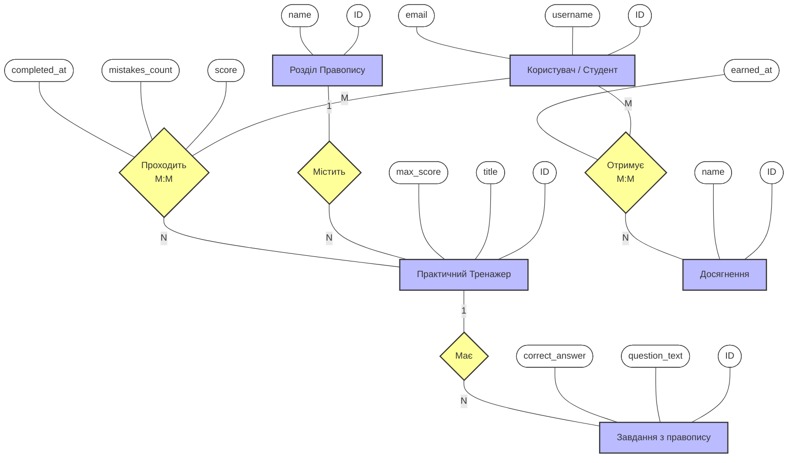
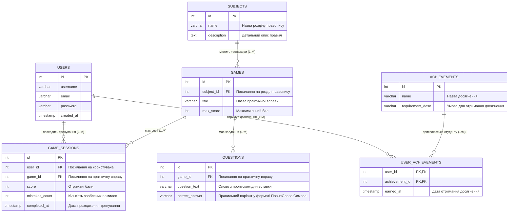

# Схеми Бази Даних для Smart-Тренажера Правопису

## 1. Концептуальна схема (Нотація Пітера Чена)

У цій нотації сутності зображені прямокутниками, їх атрибути — овалами, а зв'язки — ромбами. 
Тут ми маємо зв'язки «Багато-до-Багатьох» (M:M), які на концептуальному етапі показані напряму. Атрибути, що виникають внаслідок взаємодії (наприклад, результат тренування), прив'язані до самого ромбу зв'язку.

## 2. Логічна схема (Нотація Crow's Foot / Вороняча лапка)

На етапі логічного проектування зв'язки «Багато-до-Багатьох» (M:M) розбиваються на два зв'язки «Один-до-Багатьох» (1:M) за допомогою **асоціативних таблиць** (перетинів). Тут `GAME_SESSIONS` грає роль таблиці сесій тренувань (зберігає статистику проходження конкретного тренажера конкретним юзером), а `USER_ACHIEVEMENTS` — отримані досягнення.

